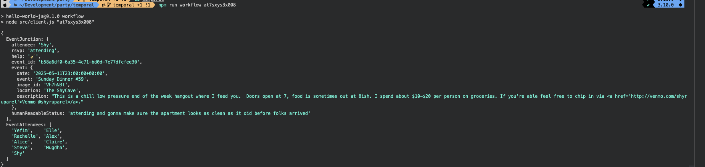
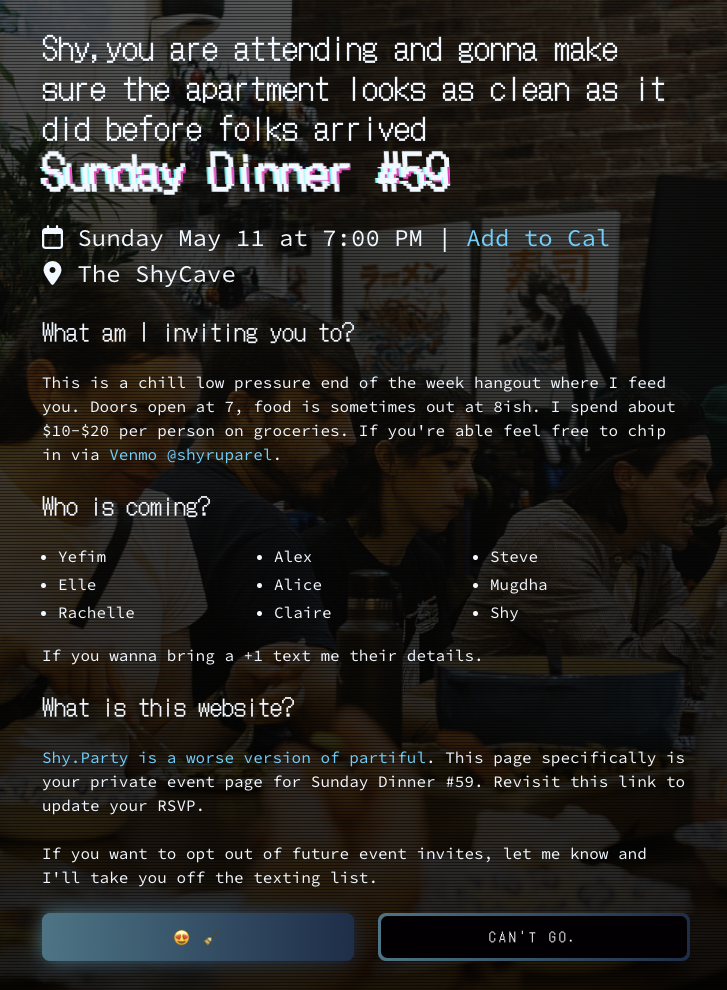
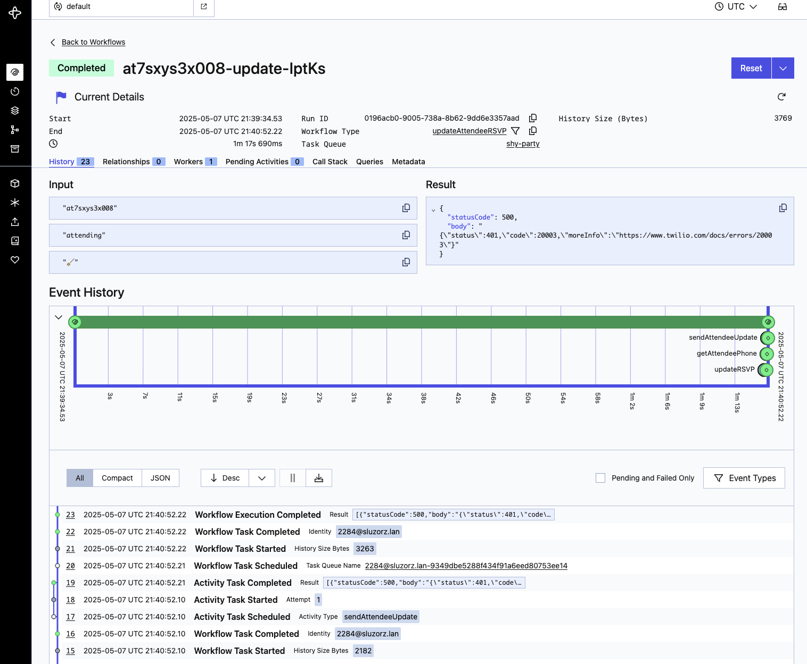

# Shy.party

This is a [worse version of partiful](https://www.youtube.com/watch?v=gu0SjNfSzyQ) I use to run dinner parties for myself and my friends every other week.

It's an existing code base, that I've repuropsed in this branch to explore using temporal. Currently the project uses flask frozen to generate a static site with routes for each of my attendees. That site that is live on the internet currently utilizes netlify to handle backend work. I use netlify edge functions to update the static page with live data before it's delivered to a user. Form submission is handled by netlify's function support.

## Temporal 
To bring in temporal I've replaced the netlify backend with workers and activities. You can take a look at the code in the [temporal directory](temporal). 

### Usage
Prerequisites:

* [Temporal CLI installed](https://docs.temporal.io/cli#install)
* [Local Temporal server running](https://docs.temporal.io/cli/server#start-dev)
* Node 22
* Python 3.10 if you'd like to see the front end. 
* PSQL DB (See below for previous role out, this code is a little crufty and needs updating to account for a bunch of schema changes I've made over the last year of running this app. I'm currently using supabase to host my data, and levering their js libary within the activities.)


### Running the worker

We can start the worker by navigating into the temporal directory from our terminal. Make sure to install all the dependences with `npm install`. 

To starter our workers we can run.

```bash
npm run start.watch
```

To see the project in action from the cli, in a new terminal window run.

```bash
npm run workflow {website slug}
```


This will run our client.js file which will spin up a new workflow to get the information needed to customize an invite for an attendee with the `getAttendeeStatusInfo` workflow. This workflow has two seprate activities. First it grabs information related to the event, such as date, location, and an attendees RSVP with `getEventJunctionData`. In the second activity `getEventAttendence`, it requests the names of everyone else who rsvped to show a live attendence for the event.

Next it'll test updating our DB by running our `updateAttendeeRSVP` workflow. This workflow first updates our database with the `updateRSVP` activity, then grabs the information of the attendee using `getAttendeePhone` to send a status update to our attendee. If you provide twilio creds in the .flaskenv file it'll send out a text message using the `sendAttendeeUpdate` activity, otherwise it'll return successfully (supressing the error as I didn't want to send messsages in testing.)

### Serving the front end.

In our python front end we'll be using these 2 workflows to provide live data to our users and update their RSVPs. Install all your dependencies with `pip install -r requirements.txt` from the root of the project. Make sure to update the .flaskenv with the approriate variables for your usecase. To run the project use `flask run`.  Make sure the temporal server and workers started by `npm run start.watch` are still running.

Taking a look at the code in the [routes.py](app/routes.py) you can see our python code creates a workflow on a page request to grab the most recent data from our database about event attendence

```python

@app.route("/rsvp/<event_junction_public_id>/", methods=["GET"])
async def attendee_rsvp(event_junction_public_id):
    client = get_client()
    handle = await client.start_workflow(
        "getAttendeeStatusInfo",
        event_junction_public_id,
        id="shy.party/rsvp/" + event_junction_public_id,
        task_queue="shy-party",
    )
  ```

Flask takes this information and uses it to create our webpage. 


Similarly when clicking the button to update attendence, our webpage will make a post request to our flask server, which will use our previous workflow `updateAttendeeRSVP` to update our database and alert the user if required. 




## Previous Readme for reference
To deploy this you'll need a PSQL DB.

## Create SQL Server

I'm using a postgres instance hosted on supabase's serverless free tier to handle data. You can create the needed tables with:

```psql
CREATE TABLE public.attendee (
  id UUID NOT NULL DEFAULT gen_random_uuid(),
  public_id VARCHAR(12) NOT NULL,
  attendee VARCHAR(255) NOT NULL,
  phone VARCHAR(15) NOT NULL,
  dietary_restrictions VARCHAR(255) NULL,
  created_at TIMESTAMPTZ NULL DEFAULT current_timestamp():::TIMESTAMPTZ,
  updated_at TIMESTAMPTZ NULL DEFAULT current_timestamp():::TIMESTAMPTZ ON UPDATE current_timestamp():::TIMESTAMPTZ,
  invited BOOL NOT NULL DEFAULT true,
  CONSTRAINT attendee_pkey PRIMARY KEY (id ASC)
)

CREATE TABLE public.events (
  id UUID NOT NULL DEFAULT gen_random_uuid(),
  public_id VARCHAR(12) NOT NULL,
  event VARCHAR(255) NOT NULL,
  date TIMESTAMPTZ(6) NOT NULL,
  location VARCHAR(600) NOT NULL,
  description VARCHAR(1000) NOT NULL,
  created_at TIMESTAMPTZ NULL DEFAULT current_timestamp():::TIMESTAMPTZ,
  updated_at TIMESTAMPTZ NULL DEFAULT current_timestamp():::TIMESTAMPTZ ON UPDATE current_timestamp():::TIMESTAMPTZ,
  CONSTRAINT events_pkey PRIMARY KEY (id ASC)
)

CREATE TABLE public.event_attendee_junction (
  id UUID NOT NULL DEFAULT gen_random_uuid(),
  public_id VARCHAR(12) NOT NULL,
  event_id UUID NULL,
  attendee_id UUID NULL,
  rsvp VARCHAR(13) NULL,
  created_at TIMESTAMPTZ NULL DEFAULT current_timestamp():::TIMESTAMPTZ,
  updated_at TIMESTAMPTZ NULL DEFAULT current_timestamp():::TIMESTAMPTZ ON UPDATE current_timestamp():::TIMESTAMPTZ,
  sms_status INT8 NULL DEFAULT 0:::INT8,
  CONSTRAINT event_attendee_junction_pkey PRIMARY KEY (id ASC),
  CONSTRAINT event_attendee_junction_event_id_fkey FOREIGN KEY (event_id) REFERENCES public.events(id) ON DELETE CASCADE ON UPDATE CASCADE,
  CONSTRAINT event_attendee_junction_attendee_id_fkey FOREIGN KEY (attendee_id) REFERENCES public.attendee(id) ON UPDATE CASCADE
)
```

I write sql queries to manage all my admin stuff. Ping me if you want more details.

## Deploy

You can deploy this repo and just point it at your own DB (formatted with the above instructions). Whenever I push a code update it'll trigger a new build so you'll always have the latest version. I try not to make table updates often to prevent breaking things.

 You only need to fork this repo if you wanna run it locally.

## Running locally

Save the `.flaskenv.sample` locally as  `.flaskenv` and replace all the creds.

Install with

```bash
pip install -r requirements.txt
```

Run locally with

```bash
flask run
```

This will spin up a live version of the site to play with styling.

Since it's a static site you'll need to actually freeze the website now that you have data. You can do this with.
```bash
python freeze.py
```

This will create a build directory that will contain all the static files that'll be served out when this is deployed on netlify. Now to debug all the netlify stuff you'll need use the netlify CLI.

Go ahead and run `npm install` to install the netlify cli and axois.

Now to run this website and test out the netlify functions run:

```bash
netlify dev -d app/build/ --debug
```

You'll need to rerun the freeze script anytime you make a change on the flask code. No python actually runs on the server since this is a static site. It just executes at build time.
